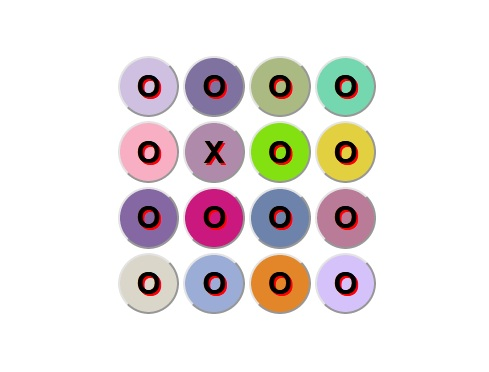

# RGB-Color-Changer
RGB Color Changer written in HTML, CSS, JS

## Features
4x4 button area. When clicking button next to 'X' buttons color will change(randomly red, green or blue value random amount from 0-50 up to 255)
